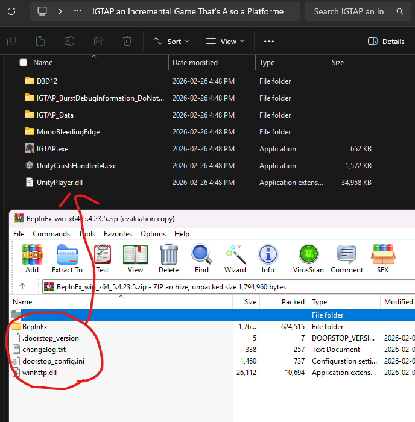

# IGTAP Save Slot Manager Plugin

A BepInEx mod for **IGTAP — *An Incremental Game That's Also a Platformer*** that adds a 10-slot save state system — useful for TAS work, sequence experimentation, or just keeping multiple checkpoints.

---

## Features

- **10 save slots** — store and restore full save states at any point
- **Auto save-before-load** — triggers the game's own save routine before returning to the main menu on load
- **Crash recovery** — a sentinel file detects incomplete operations on startup and re-runs them automatically
- **Backup on load** — your current save is backed up to `Backup_BeforeLoad` before any slot is loaded
- **On-screen HUD** — current slot and status messages displayed in-game

---

## Requirements

* **BepInEx 5.4.23.5 (x64)**
  https://github.com/BepInEx/BepInEx/releases/tag/v5.4.23.5

* Plugin download:
  https://github.com/pseudo-psychic/IGTAPSaveSlots/releases/

Tested on **March 2, 2026**.

---

## Installation

### 1️⃣ Install BepInEx

Download:

```
BepInEx_win_x64_5.4.23.5.zip
```

Open Steam → **IGTAP Demo**

Click:

```
Manage → Browse local files
```

#### Example (Steam menu)


---

Open the BepInEx zip and **copy ALL contents** into the game directory
(the folder containing `IGTAP.exe`).

#### Files inside the BepInEx archive



---

### 2️⃣ Generate BepInEx Folders

1. Run the game once using `IGTAP.exe`
2. Close the game

This automatically creates:

```
BepInEx/plugins
```

---

### 3️⃣ Install the Save Slot Manager Plugin

1. Download the plugin `.dll` from Releases.
2. Place the file into:

```
BepInEx/plugins
```

---

### 4️⃣ Run the Game

Launch the game normally through Steam or the executable.

The plugin loads automatically. A `IGTAP_SaveSlots/` folder will be created in `gamedirectory/BepInEx/`.

---

## ✅ Final Folder Structure

Your game folder should look similar to this:

```
IGTAP/
│
├── BepInEx/
├── D3D12/
├── IGTAP_Data/
├── MonoBleedingEdge/
│
├── .doorstop_version
├── doorstop_config.ini
├── winhttp.dll
│
├── IGTAP.exe
├── UnityPlayer.dll
└── UnityCrashHandler64.exe
```

#### Example completed install


---

## Controls

| Key | Action |
|-----|--------|
| `F1` | Save current game to the selected slot |
| `F2` | Load the selected slot (returns to main menu first) |
| `F3` | Select previous slot |
| `F4` | Select next slot |

The current slot and its status (`✓` = has data, `[empty]` = nothing saved yet) are shown in the top-right corner of the screen.

---

## How It Works

### Saving (`F1`)
1. Calls the game's internal `manualSave()` method and waits for it to complete.
2. Copies the game's save directory into `IGTAP_SaveSlots/Slot_N/`.

### Loading (`F2`)
1. Calls the game's `changeScene()` (pause menu → main menu) to trigger an autosave.
2. Waits for the save and scene transition to finish.
3. Backs up your current save to `IGTAP_SaveSlots/Backup_BeforeLoad/`.
4. Replaces the game's save directory with the contents of the selected slot.
5. Returns you to the main menu — press Play to start from the loaded state.

### Crash Recovery
Before any file operation, a `WORKING` sentinel file is written describing what's being done. On the next startup, if that file exists, the operation is re-run. This prevents save corruption from crashes mid-copy.

---

## File Locations

| Path | Description |
|------|-------------|
| `BepInEx/IGTAP_SaveSlots/Slot_0` … `Slot_9` | The 10 save slots |
| `IGTAP_SaveSlots/Backup_BeforeLoad/` | Auto-backup taken before each load |
| `IGTAP_SaveSlots/WORKING` | Crash-recovery sentinel (deleted after successful ops) |
| `%USERPROFILE%/AppData/LocalLow/Pepper tango games/IGTAP/` | Game's live save directory |

---

## Notes

- `.log` files are never copied or deleted — `Player.log` is left untouched in all operations.
- Slots display `[empty]` indicator if they do not contain data.

---

## License

See repository license for details.
